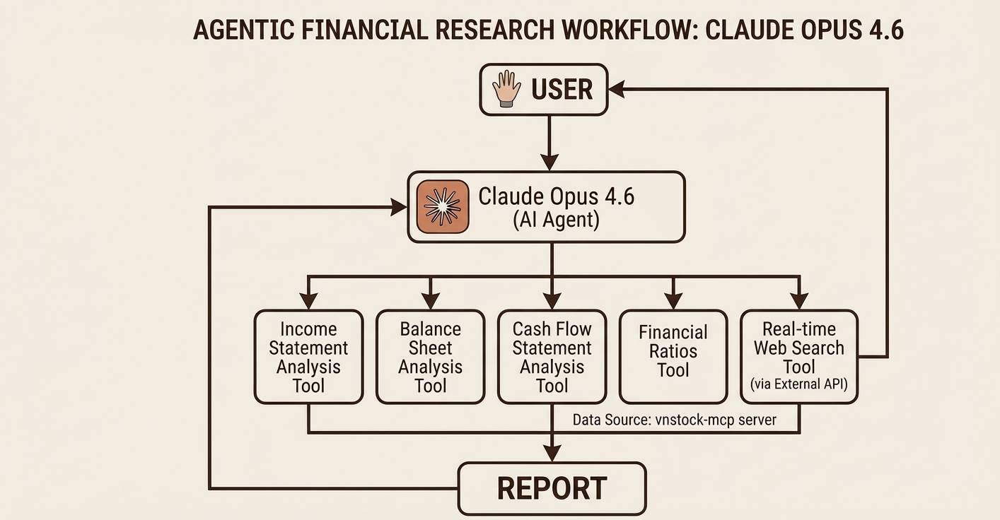

# HPG Financial Analysis — Agentic AI Research Workflow

An advanced financial research system powered by **Claude Opus 4.6** with custom Model Context Protocol (MCP) servers, demonstrating autonomous tool use, real-time web search, and multi-statement financial analysis.

## Overview

This project showcases how agentic AI can autonomously analyze complex financial data by leveraging specialized MCP server tools. The system analyzes **Hòa Phát Group (HPG)**, Vietnam's largest steelmaker, using comprehensive income statements, balance sheets, and cash flow data spanning **FY2013–2025**.

**Result:** An interactive HTML report with 12 detailed analysis sections, 11 interactive charts, financial metrics, and strategic insights.

---

## Architecture



### Custom MCP Servers

The agent accesses financial data through specialized MCP servers:

1. **Income Statement Analysis Tool**
   - Revenue, COGS, gross profit, operating profit
   - Margin analysis (gross, EBIT, net)
   - Expense tracking (financial, selling, G&A)

2. **Balance Sheet Analysis Tool**
   - Asset composition (current, fixed, investments)
   - Liability structure (short-term, long-term debt)
   - Equity changes and working capital metrics

3. **Cash Flow Statement Analysis Tool**
   - Operating cash flow, capex, free cash flow
   - Financing activities, debt proceeds/repayment
   - Dividend payouts and cash positioning

4. **Financial Ratios Tool**
   - Profitability (ROE, ROA, ROIC, margins)
   - Liquidity (current, quick, cash ratios)
   - Leverage (debt-to-equity, leverage ratio)
   - Valuation (P/E, P/B, EV/EBITDA)

5. **Real-time Web Search Tool**
   - Market sentiment and industry trends
   - Competitive positioning
   - Regulatory or geopolitical context

---

## Report Contents

### 12 Analysis Sections

| Section | Focus | Key Metrics |
|---------|-------|-----------|
| 1 | Revenue & Profit Trends | YoY growth, cyclical patterns, margin recovery |
| 2 | Liquidity Position | Current/quick/cash ratios, D/E, refinancing risk |
| 3 | Free Cash Flow | FCF trends, capex intensity, cash burn periods |
| 4 | Expense Flags | Financial costs, interest burden, capex analysis |
| 5 | Dividends vs. Cash Generation | Payout ratios, reinvestment discipline |
| 6 | Valuation Ratios | P/E, P/B, EV/EBITDA, EPS recovery |
| 7 | Price vs. Earnings | Stock alignment, historical P/E trends |
| 8 | Profitability Analysis | ROE/ROA/ROIC evolution, NOPAT trends |
| 9 | Effective Tax Rate & NOPAT | Tax efficiency, operating profit after tax |
| 10 | DuPont 5-Factor Decomposition | ROE drivers: margin, turnover, leverage |
| 11 | Profitability & Efficiency Mismatches | Key tensions in financial performance |
| 12 | Overall Financial Health | Grade assessment, bull/bear cases, risk analysis |

### 11 Interactive Charts

- **C1:** Revenue, net profit, gross & net margins (dual-axis)
- **C2:** Liquidity ratios (current, quick, cash) + D/E leverage
- **C3:** Operating CF, capex, and FCF waterfall
- **C4:** Stacked expense composition (COGS, financial, selling, G&A)
- **C5:** Operating CF vs. dividend payouts
- **C6:** P/E, P/B, and EV/EBITDA valuation trends
- **C7:** EPS vs. P/E multiple tracking
- **C8:** ROE, ROA, and ROIC evolution
- **C9:** Effective tax rate and NOPAT progression
- **C10:** DuPont 5-factor component analysis
- **C11:** Margin vs. asset turnover vs. ROIC mismatch

All charts are interactive (zoom, pan, legend toggle) using Chart.js.

---

## Technical Stack

- **AI Agent:** Claude Opus 4.6 (tool-using reasoning)
- **Tool Interface:** Model Context Protocol (MCP)
- **Data Source:** vnstock (Vietnamese stock market library) + web search APIs
- **Frontend:** Vanilla JavaScript + Chart.js
- **Data Format:** Raw financial statements (VND billions, 13-year history)
- **Styling:** Custom CSS design system (DM Sans + DM Mono typography)

### Custom MCP Server

The agent's financial data access is powered by a custom MCP server implementation:

**vnstock-mcp**
- Repository: https://github.com/gahoccode/vnstock-mcp
- Purpose: Exposes Vietnamese stock market data as MCP tools for Claude
- Capabilities:
  - Financial statement retrieval (income, balance sheet, cash flow)
  - Company metrics and ratios
  - Historical price data
  - Market fundamentals
- Integration: Claude calls vnstock-mcp tools via standard MCP protocol, treating them as first-class reasoning tools alongside web search

This MCP server bridges the AI agent directly to Vietnam's stock market data, enabling autonomous financial analysis without requiring manual data entry or external APIs.

---

## Project Structure

```
hpg/
├── index.html              # Main interactive report (self-contained)
├── img/
│   └── research_workflow.jpg  # Architecture diagram
├── README.md               # This file
└── @CHANGELOG.md           # Version history (optional)
```

### index.html Structure

- **Lines 1–62:** HTML head + embedded CSS (design system)
- **Lines 76–158:** Raw financial data (IS, BS, CF, Ratios)
  - 13 years (2013–2025)
  - All figures in Bn VND unless noted
- **Lines 159–185:** Derived metrics (FCF, NOPAT, DuPont, etc.)
- **Lines 199–234:** Chart configuration helpers
- **Lines 215–556:** Dynamic HTML generation (12 sections)
- **Lines 560–751:** Chart rendering (11 interactive visualizations)

---

## Usage

### View the Report

**Live Interactive Version (Published Artifact)**

The complete interactive report is published and available here:
https://claude.ai/public/artifacts/fb78aa00-7ef4-479f-a139-e469288bb799

Open this link to view the live version with all interactive charts, metrics, and analysis sections.

**Local Version**

To run the report locally, simply open `index.html` in a modern web browser:

```bash
open index.html
# or
firefox index.html
```

### Interactive Features

- **Charts:** Hover for tooltips, click legend to toggle series, scroll to zoom
- **Tables:** Sortable metrics across fiscal years
- **Insight Boxes:** Flagged risks (danger/warning/ok/info)
- **Metrics Grid:** Key summary statistics with delta indicators

### Modify Data

To update with new financial statements:

1. Edit the raw data objects in `index.html` (lines 83–149)
   - `IS` (Income Statement)
   - `BS` (Balance Sheet)
   - `CF` (Cash Flow)
   - `R` (Ratios)

2. Adjust `years` array if adding/removing fiscal years

3. Refresh the browser to regenerate all charts and metrics

---

## Agentic Workflow (How It Works)

The AI completed this entire project through a single-shot autonomous process:
1. **Deep research phase** — Claude conducted exploratory analysis to understand what financial metrics, ratios, and insights would be needed
2. **Tool invocation phase** — All necessary MCP server tools were called in sequence to gather raw financial data and compute derived metrics
3. **Report generation phase** — The complete HTML report (index.html) with all 12 sections, 11 interactive charts, and strategic insights was generated and rendered in a single attempt

No human intervention was required between data gathering and final output. The agent reasoned through the entire workflow autonomously.

**Resource Usage:** The complete analysis consumed approximately 30% of the daily usage limit, reflecting the depth of research, tool invocations, and multi-pass analysis required to synthesize a comprehensive financial report.

### Step 1: User Request
User provides a query: *"Analyze HPG's financial health and sustainability."*

### Step 2: Agent Reasoning
Claude Opus 4.6 breaks down the request:
- What financial statements are needed? (income, balance sheet, cash flow)
- What ratios indicate health? (liquidity, leverage, profitability)
- What context is missing? (industry trends, competitive position)

### Step 3: Tool Invocations
Agent calls MCP servers in sequence via the vnstock-mcp custom server:

```
Agent → vnstock-mcp (Income Statement): "Get HPG revenue, COGS, profit 2013–2025"
        ↓
        ← Returns: 13 years of income statement data, margin calculations

Agent → vnstock-mcp (Balance Sheet): "Get HPG assets, liabilities, equity 2013–2025"
        ↓
        ← Returns: asset composition, debt structure, working capital

Agent → vnstock-mcp (Cash Flow): "Get HPG operating CF, capex, FCF 2013–2025"
        ↓
        ← Returns: cash generation, capital investment, dividend history

Agent → vnstock-mcp (Financial Ratios): "Calculate ROE, ROA, ROIC, DuPont"
        ↓
        ← Returns: profitability, liquidity, leverage, and return metrics

Agent → Web Search: "HPG Dung Quất 2 project status 2024–2025"
        ↓
        ← Returns: news articles, industry trends, competitive context
```

**MCP Protocol in Action:**
The vnstock-mcp server exposes each financial statement type as a callable tool. Claude Opus 4.6 introspects available tools, decides which ones are needed, and invokes them with appropriate parameters (ticker symbol, date range, metric type). The server returns structured JSON data, which Claude then synthesizes into insights.

### Step 4: Analysis & Synthesis
Agent synthesizes findings:
- Identifies cyclical patterns (2021 supercycle, 2022–23 correction)
- Spots mismatches (margin recovery vs. declining turnover)
- Assesses sustainability (ROIC < WACC, capex burden)
- Weighs bull/bear cases with evidence

### Step 5: Report Generation
Agent structures insights into 12 sections with:
- Key metrics and deltas
- Interactive charts with dual axes
- Insight boxes with flags (danger/warning/ok)
- Strategic verdict with catalyst analysis

---

## Data Quality & Assumptions

- **Data Source:** Official HPG financial statements (VND, unadjusted)
- **Period:** FY2013–2025 (13 fiscal years)
- **Currency:** Billion VND (Bn) throughout
- **Rounding:** Charts and metrics rounded per display context
- **Tax Rate:** Effective rate computed from actual tax paid + deferred
- **WACC Estimate:** ~10–11% (implied from industry comparables)
- **Capex Normalized After 2025:** Assumes Dung Quất 2 completion

---

## Key Metrics Definitions

| Metric | Formula | Interpretation |
|--------|---------|-----------------|
| **EBITDA** | Operating Profit + D&A | Operating cash generation potential |
| **FCF** | Operating CF − Capex | Free cash available to equity holders |
| **NOPAT** | Operating Profit × (1 − Tax Rate) | After-tax operating profit |
| **ROIC** | NOPAT / Invested Capital | Return on incremental capital invested |
| **D/E Ratio** | Total Debt / Equity | Leverage relative to equity base |
| **Quick Ratio** | (Current Assets − Inventory) / Current Liabilities | Immediate liquidity without inventory |
| **EV/EBITDA** | Enterprise Value / EBITDA | Valuation multiple on operating cash flow |

---

## Next Steps & Extensions

Possible enhancements:

1. **Peer Comparison** — Add benchmark ratios for other Vietnamese/regional steelmakers
2. **DCF Model** — Project future cash flows based on DQ2 ramp assumptions
3. **Scenario Analysis** — Model bull/bear cases with sensitivity tables
4. **Real-time Updates** — Auto-pull latest quarterly data via vnstock API
5. **Export Options** — Generate PDF reports or Excel exports
6. **Mobile Optimization** — Responsive layout for smaller screens

---

## License & Attribution

- **Data:** HPG official financial statements (public)
- **Analysis:** Agentic AI research workflow powered by Claude Opus 4.6
- **Workflow Design:** Demonstrates MCP tool integration for financial research
- **Visualization:** Chart.js for interactive charting

---

## Questions & Feedback

For questions on:
- **Architecture:** How the agentic workflow integrates with MCP servers
- **Analysis:** Interpretation of HPG's financial position and outlook
- **Report:** Metric definitions or chart methodology

Refer to the corresponding analysis section in `index.html` or extend the workflow with additional MCP tools.

---

**Generated:** 2026-03-14
**Report Period:** FY2013–2025
**Company:** Hòa Phát Group (HPG) — Vietnam's Leading Integrated Steelmaker
